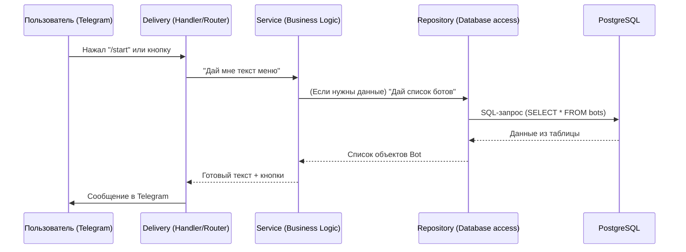

# Полный разбор проекта Telegram Bot Navigator 🚀

Бро, привет! Здесь я разложил всё «по полочкам»: от того, как устроены папки, до того, как данные бегают по коду. Этот проект построен на принципах **Clean Architecture** (Чистая архитектура).

## 1. Зачем такая сложность? (Clean Architecture)

Главная идея — **разделение ответственности**.
- Если мы захотим сменить базу данных (например, с PostgreSQL на MongoDB), нам нужно будет изменить только папку `repository`.
- Если мы захотим сменить библиотеку Telegram (или сделать веб-интерфейс), мы изменим только `delivery`.
- **Бизнес-логика** (`service`) всегда остается нетронутой.

---

## 2. Структура папок

Вот твоя карта проекта:

```text
testTGBot/
├── cmd/
│   └── main.go          # «Сердце» и клей. Собирает все слои воедино.
├── internal/
│   ├── models/          # Слой Domain (Сущности). Здесь только структуры данных.
│   ├── repository/      # Слой Data Access. Работа с базой данных (SQL).
│   ├── service/         # Слой Business Logic. Главные мозги и форматирование текста.
│   └── delivery/        # Слой Presentation. Обработка команд Telegram.
├── pkg/
│   ├── config/          # Загрузка настроек из .env.
│   └── logger/          # Красивое логирование в терминал.
├── migrations/          # SQL-файлы для создания таблиц в БД.
└── docker-compose.yml   # Легкий запуск базы данных в одну команду.
```

---

## 3. Путь данных (Как это работает)

Когда ты нажимаешь кнопку в Telegram, происходит следующее:



---

## 4. Разбор слоев кода

### 📦 Models (`internal/models`)
Это самые простые файлы. Здесь описаны «правила игры». Что такое `Bot`? Это ID, имя, ссылка и категория. Никакой логики, только описание.

### 💾 Repository (`internal/repository`)
Здесь живут SQL-запросы.
- `postgres.go`: Подключается к базе.
- `bot_repo.go`: Содержит методы вроде `GetBotsByCategory`. Он берет сырые строки из базы и превращает их в объекты `models.Bot`.

### 🧠 Service (`internal/service`)
Связующее звено.
- `bot_service.go`: Решает, какие данные и когда брать.
- `menu_service.go`: **Дизайнер**. Он берет данные о боте и превращает их в красивый HTML-текст с иконками, который увидит пользователь.

### 🤖 Delivery (`internal/delivery/telegram`)
Это «лицо» бота.
- `router.go`: Смотрит, что пришло (текст или нажатие кнопки) и отправляет к нужному обработчику.
- `handler.go`: Обрабатывает конкретные действия. Например, `HandleStart` просто говорит сервису: «Дай текст приветствия» и отправляет его в Telegram.

---

## 5. Сборка всего воедино (`cmd/main.go`)

Это самый важный файл для понимания «клея». В нем происходит **Dependency Injection** (Внедрение зависимостей):

1. Создаем репозиторий: `repo := NewRepo(db)`
2. Создаем сервис и отдаем ему репозиторий: `svc := NewService(repo)`
3. Создаем обработчик и отдаем ему сервис: `hnd := NewHandler(svc)`
4. Запускаем бота с этим обработчиком.

Это позволяет каждой части кода не знать лишнего о других частях.

---

## 6. База данных и Docker

- **Docker Compose**: Позволяет тебе не устанавливать Postgres на компьютер. Он поднимает «изолированную комнату» с базой.
- **Migrations**: Когда Docker запускает базу, он смотрит в папку `migrations` и сам создает таблицы. Это гарантирует, что у тебя и у любого другого разработчика база будет одинаковой.

---

## 7. Твои дальнейшие шаги

1. **Добавить бота**: Добавь строку в `migrations/002_seed_data.sql`.
2. **Изменить текст**: Иди в `internal/service/menu_service.go`.
3. **Новая фича**:
   - Опиши модель в `models`.
   - Создай метод в `repository`.
   - Добавь логику в `service`.
   - Сделай кнопку/команду в `delivery`.

Профит! Ты великолепен. 😎
